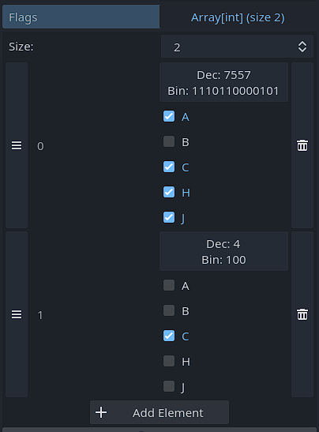
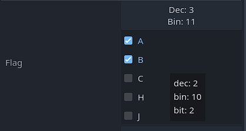

# gd-flags-inspector

A custom inspector for Godot that helps editing bit masks

|                           |                          |
|---------------------------|--------------------------|
|   |  |

- [gd-flags-inspector](#gd-flags-inspector)
	- [Installation](#installation)
	- [Usage](#usage)
	- [Configuration](#configuration)

## Installation

Clone/Download the project into `<your_project>/addons`

## Usage

1. Add `@tool` on top of your script
2. Define your properties and flags

```js
enum SomeFlags {
  // You MUST include the values
	A = 1 << 0,
	B = 1 << 1,
	C = 1 << 2,
	H = 1 << 7,
	J = 1 << 8,
}

// No need to use the @export annotation
var flag: int
var flags: Array[int]
```

3. Implement the `_get_property_list`

```js
func _get_property_list():
	return [
		FlagsProperty.create("flag", SomeFlags),
		FlagsProperty.create_array("flags", SomeFlags)
	]

```

*`FlagsProperty.create(property_name, EnumClass)`* and *`FlagsProperty.create_array(property_name, EnumClass)`* can be both used to quickly create a property.

## Configuration

The plugin can be configured by editing the [config.ini](config.ini) file.

The plugin needs to be reloaded for the changes to apply.
